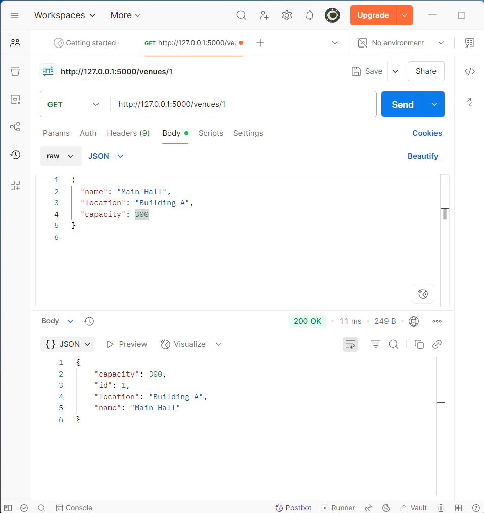

# Flask REST API with PostgreSQL

This is a simple RESTful API built using Flask and PostgreSQL with SQLAlchemy ORM. It includes endpoints to create, read, update, and delete (CRUD) venue data, and it's ready for extension with additional resources like users. The project can use Alembic for database migrations.

---

## 📁 Project Structure

```
Flask_app/
├── app.py             # Main Flask app with API routes
├── config.py          # Configuration settings (including DB URI)
├── models.py          # SQLAlchemy models and serialization
├── migration/        # Alembic migration scripts (created later)
├── alembic.ini        # Alembic configuration file
└── README.md          # Project documentation
```

---

## 📦 Requirements

Install required packages in your virtual environment:

```bash
pip install -r requirements.txt
```

---

## ⚙️ Configuration

`config.py` defines the database connection

---

## 🔧 Models

Defined in `models.py`. Example: `Venue` model with `serialize()` method for JSON response.

---

## 🚀 Running the App

Start the app (after activating your virtual environment):

```bash
flask run or python app.py
```

---

## 📮 API Endpoints

| Method | Endpoint       | Description        |
| ------ | -------------- | ------------------ |
| GET    | `/`            | Health check       |
| POST   | `/venues`      | Create a new venue |
| GET    | `/venues`      | Get all venues     |
| GET    | `/venues/<id>` | Get a single venue |
| PUT    | `/venues/<id>` | Update a venue     |
| DELETE | `/venues/<id>` | Delete a venue     |

---

## 🧪 Testing with Postman

You can use Postman to send requests to `http://localhost:5000`.

## 🧪 Example POST Request (Postman)





## 🧱 Alembic Migrations (Optional)

If using raw Alembic:

1. Initialize:

   ```bash
   alembic init migrations
   ```

2. Configure `alembic.ini` with your database URI or modify `env.py` to import from `Config`.

3. Create and apply migration:

   ```bash
   alembic revision --autogenerate -m "Create Venue table"
   alembic upgrade head
   ```

---
